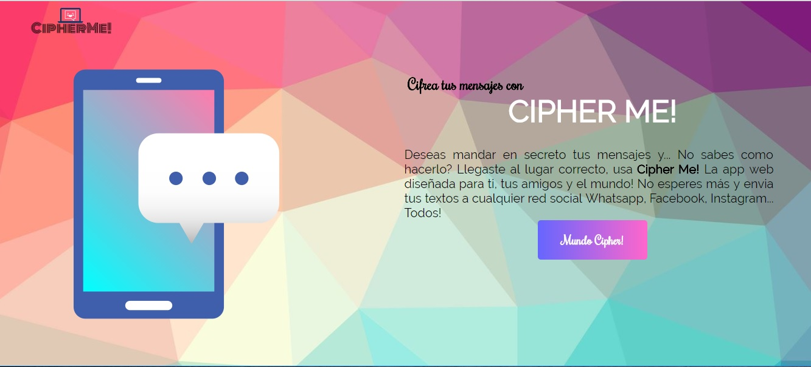

# CIPHERME! APP

## Intro
Esta WEB APP nos ayuda a cifrar y descifrar mensajes del usuario con la tecnica
de cifrado mas simple y usada que es CIFRADO CESAR.

## Cifrado Cesar
El [cifrado César](https://en.wikipedia.org/wiki/Caesar_cipher) es uno de los
primeros métodos de cifrado conocidos históricamente. Es un tipo de cifrado por
sustitución en el que una letra en el texto original es reemplazada por otra
letra que se encuentra un número fijo de posiciones más adelante en el alfabeto.

El emperador Julio César lo usaba para enviar órdenes a sus generales en los
campos de batalla, es una de las técnicas más simples y más usadas para cifrar
un mensaje.

Por ejemplo si usáramos un desplazamiento de 3:

* Alfabeto sin cifrar: A B C D E F G H I J K L M N O P Q R S T U V W X Y Z
* Alfabeto cifrado: D E F G H I J K L M N O P Q R S T U V W X Y Z A B C

Actualmente todos los cifrados de sustitución alfabética simple, se descifran
con facilidad y en la práctica no ofrece mucha seguridad en la comunicación,
pero el cifrado César muchas veces puede formar parte de sistemas más complejos
de codificación, como el cifrado Vigenère, e incluso tiene aplicación en el
sistema ROT13.

## Preambulo
Deseas mandar en secreto tus mensajes y... No sabes como hacerlo? Llegaste al lugar
correcto, usa Cipher Me! La app web diseñada para ti, tus amigos y el mundo!
No esperes más y envia tus textos a cualquier red social Whatsapp, Facebook, Instagram...
Todos!

## Tecnologia usada
Esta web app usa las siguientes tecnologias:
• HTML
• CSS
• JAVASCRIPT

## Definicion del Producto
El uso de la web app esta dirigido a todo tipo de usuarios que deseen encriptar
o desencriptar un texto.
El objetivo es que el usuario pueda realizar esas acciones sin ningun problema y facil
manejo del producto.

## Instalacion
Entra al siguiente enlace para que navegas -> https://jslyne.github.io/lim-2018-05-bc-core-pm-cipher/
